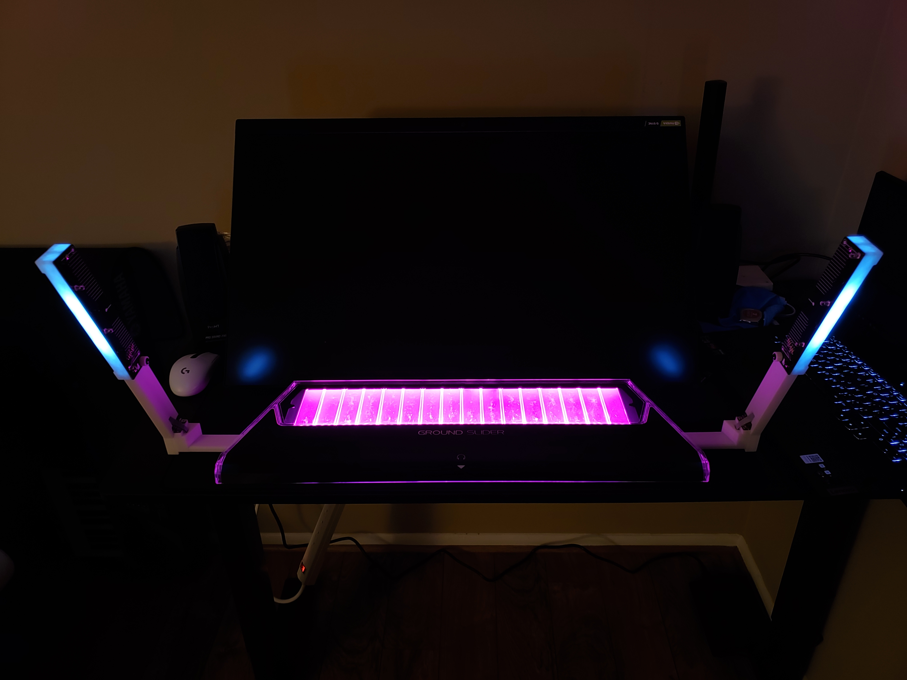
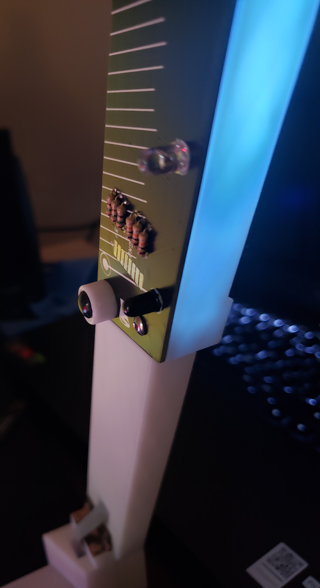
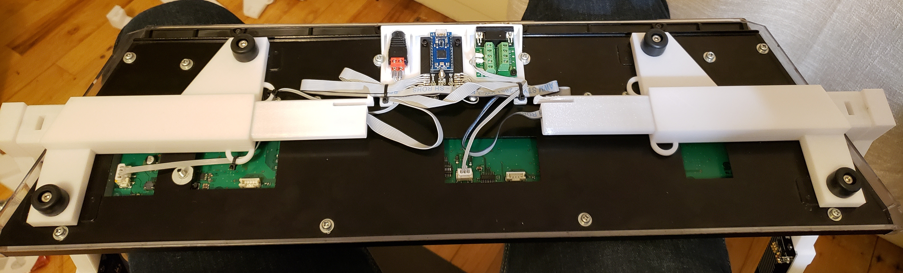

# chuni-lite
Slidy air towers for an arcade chuni slider without backplate.  Bare minimum docs because I don't expect too many people to have access to chuni cab sliders without backplates.

Current versions can be found at:
- CAD: chuni-lite\chunair-cad\airs\print\f1
- PCB: chuni-lite\chunair\chunair\chunair_v2\v2-1-2 & chuni-lite\chunair\chunair_core\v1

Note: I swapped the side the pads are on for chunair_core.  Oops.  Wires will go across the board for now, no biggie.  WS2811/WS2812B optional.

Slider needs:
- HiLetgo 2pcs DB9 Female Adapter RS232 to Terminal RS232 Serial to Terminal DB9 Connector Convert Adapter https://www.amazon.com/gp/product/B082F873KQ (technically just one)
- CQRobot 450 Pieces 2.54mm JST-XA JST Connector Kit. 2.54mm Pitch Female Pin Header, JST XA 2/3 / 4 Pin Housing JST Adapter Cable Connector Socket Male and Female, Crimp DIP Kit. https://www.amazon.com/gp/product/B085QMRHK6 (technically just a 3 & 4 pin).  3 pin needed pegs clipped.
- USB to VGA/RS-232 Male 9 PIN DB9 Serial Cable 2 FT WIN10/8.1/8/7 PERFECT VISION https://www.amazon.com/gp/product/B097Q5D64Q/ (or any other usb to serial cable)
- 12V 1A PSU minimum with matching female barrel jack that has the screw terminals https://www.amazon.com/gp/product/B091XSVV1Y/

Air towers need:
- 1x USB C Pro Micro x1
- IR LEDs https://www.amazon.com/gp/product/B01BVGIZGC/ and IR Photodiodes https://www.amazon.com/gp/product/B01BVGIZGM (chanzon ones seem pretty high quality) x6 of each(but they come in pack of 100)
- 150 ohm resistor x6
- 10k ohm resistor x6
- some ribbon wire https://www.ebay.com/itm/334199317464 100-Feet Flat Ribbon Cable Grey 50-Conductor 28 AWG Belden 2L28050 008H100
- 12x2mm magnets https://www.ebay.com/itm/391899288494 x10 (but they come in pack of 100)
- Rubber Feet https://www.mcmaster.com/8884T21 x4
- Adhesive Rubber Feet https://www.aliexpress.com/item/1005002618606773.html x4 (but they come in pack of 100)
- M3 Nuts x18
- M3x8 x4
- M4x16 https://www.mcmaster.com/91292A118 x4 (but they come in pack of 100)
- M3x15 flat head https://www.mcmaster.com/92125A103 x8 (but they come in pack of 100)
- M3x20 round head https://www.mcmaster.com/94500A266 x6 (but they come in pack of 100)
- 1 inch hinges https://www.amazon.com/gp/product/B07WJSTNC9 (MroMax 15PCS Door Hinge 1.14" x 0.71" x 0.02" Silver Tone Metal Iron Hinges Brushed Finish Suitable for Door Cabinet Jewelry Case Wooden Box) x2 (but pack of 15) - can try other hinges but holes may not align
- 3D printed parts + a mirrored set
- USB C cable
- Hot Glue & Super Glue
- Small zip ties x4

Can hand wire, or replace air_tower_top_1 3D print with chunair pcb.  chunair_core PCB also optional, but is there for ease of wiring(find a way to secure the pro micro if you don't use chunair_core)

Basic steps:
0. Wire up your slider's 12v and DB9.  Crimps recommended.  11" 4 wire recommended for 12v, 9" 3 wire for DB9.

1. Print parts.  Then print a mirrored set.  Glue magnets with super glue except for the one on slider which is inserted from the outside - glue that one in with hot glue.  Pay attention to the magnetic poles!!

2. Assemble slider_rail and air_tower with hinge, flat head screws, and nuts and insert into slider (double check orientation)

3. Glue leds/pds if you are using air_tower_top_1.  Wire according to the diagram in "ac chuni/wiring.png".  If you have PCB, solder resistors and leds/pds - 10K resistors are marked, the other 3 are 150 ohm resistors.  With PCB, recommended wire length is around 30", 9 wires for RGB, 8 for no RGB.  
3a. If you want RGB, add a 3 piece WS2812B LED strip in the middle and solder it up like the picture.

4. Shove unsoldered end of ribbon cable through the channel.
5. Screw air_tower_top_2 to the pcb or air_tower_top_1(depending on which you have) using rounded m3 heads while threading through air_tower.  Don't forget to put the printed bumper piece on one of the screws.

6. Solder to Pro Micro or chunair_core pcb depending on what you have.  Make sure you slide the slider_rail into the slider first before soldering.

7. Repeat steps 2-6 for the other side.

8. Add zip ties to core.  Use 4 m3x8 bolts and nuts to mount db9 and chunair_core to core.  Press fit 12v barrel connector and hot glue into place.

9. Thread M4 screws through rubber foot and slider to mount to slider.

10. Use existing M4 screws on the chunithm slider to mount core.  Zip tie down core & power cable
11. Flash firmware and test to make sure everything works.  Then add adhesive rubber feet on each bumper in addition to the bottom of the airs.

This work is licensed under a Creative Commons Attribution-NonCommercial-ShareAlike 4.0 International License.
